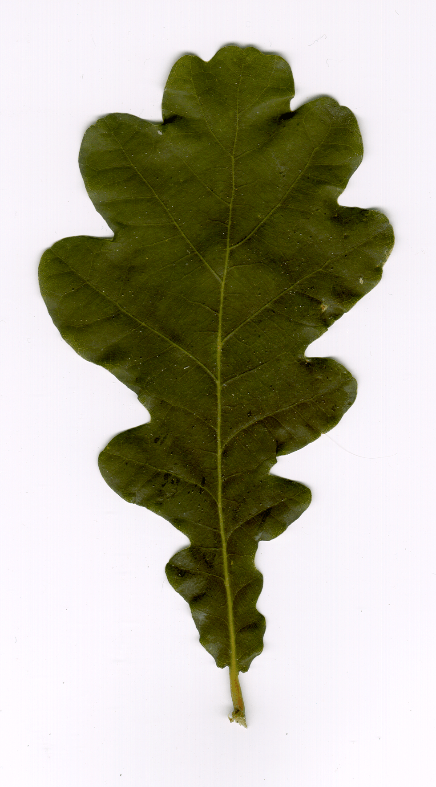

# Analysis

## Similar projects

There are a lot of similar projects. Some of which are very successful. For example [PlantNet](https://identify.plantnet.org/), [PictureThis](https://www.picturethisai.com/) and [LeafSnap](http://leafsnap.com/) are mobile apps for android and ios. Each of them reached millions of downloads on both the App Store and the Google Play Store.

Besides these, there are also a lot of amateur open source projects like the [leaf-classification project from ralavo](https://github.com/ralavo/Leaf-Classification/). This is a smaller and more feasible project that we can use as an example.

## Dataset

The ideal dataset for this project would contain pictures of leaves found in Western Europe. Preferably with a rather limited amount of species to make it easier to design and train the neural network.

In the end, we settled for the [swedish leaf dataset by the Linköping University](https://www.cvl.isy.liu.se/en/research/datasets/swedish-leaf/).
It's a collection of images from 15 different tree species found in Sweden, but most of which can be found in Belgium as well.

Here is a list of the 15 different species:

  1. Ulmus carpinifolia
  2. Acer
  3. Salix aurita
  4. Quercus
  5. Alnus incana
  6. Betula pubescens
  7. Salix alba 'Sericea'
  8. Populus tremula
  9. Ulmus glabra
  10. Sorbus aucuparia
  11. Salix sinerea
  12. Populus
  13. Tilia
  14. Sorbus intermedia
  15. Fagus silvatica

For every species, there is a total of 75 high quality TIFF images. Unfortunately, these images come in varying resolutions so they will have to get modified in order to fit the neural network. All the images are labeled by their filename. For example, every filename starts with the letter "l" to indicate that it's an image of a leaf. Following the "l", there is a number between 1 and 15 indicating which species it belongs to (1 stands for Ulmus carpinifolia, 2 stands for Acer, ...). Finally the filename ends with a number between 1 and 75 which is the unique identifier of each image.

Here is the example of an oak leaf (Quercus) from this dataset:



## Neural Network

For the AI-model we will make a CCN (Convolutional Neural network). CCN's are the most effective type of networks for analyzing images.
In order to get decent results, the network must contain multiple hidden layers. As activation function on these hidden layers we'll use Rectified Linear Unit (ReLU). And as activation function on the output layer, we'll use Softmax because it pushes the result in favor of only one specific output node. This is needed because the result can only be one of the fifteen different species. Finally we'll also train the model in batches because it improves the generalization and the training speed of the neural network.

## Tools

### [Python](https://www.python.org/)

Python is a modern high-level general-purpose programming language. It excels in building AI-models becaus it is compatible with the many AI libraries and frameworks that are available.

### [Matlab](https://nl.mathworks.com/products/matlab.html)

Matlab is a perfect programming language for preprocessing the images. It can be used to grayscale the image, center the leaf and rescale te image to a fixed resolution.

### [Keras](https://keras.io/)

Keras is an open-source framework that integrates with the TensorFlow library. It reduces the code complexity which makes it a lot easier to build a neural network. It also helps for an outsider to see how the neural network is structured.

Conda install:

```zsh
conda install -c conda-forge keras
```

## Hardware

Hardware-wise this project requires a computer to run the code. A powerful CPU or GPU are useful to process the images and train the neural network.

## Operating System

This project requires an operating system that can run both python and matlab code. So all modern operating systems like Windows, Linux and MacOS will be able to run this project.

## Deployment

Ideally, this project would be deployed as a mobile app since people carry their smartphone with them when exploring their garden or a forest.
Unfortunately it's very hard to get the matlab code to work on mobile since the matlab compiler doesn't support it. However, it might be possible to use the Matlab Coder to generate C code from the matlab algorithm (which does run on mobile) but that requires a lot of work.
