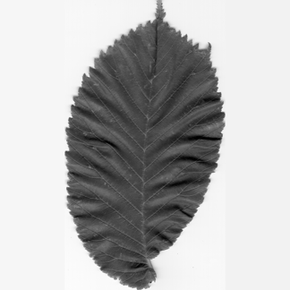
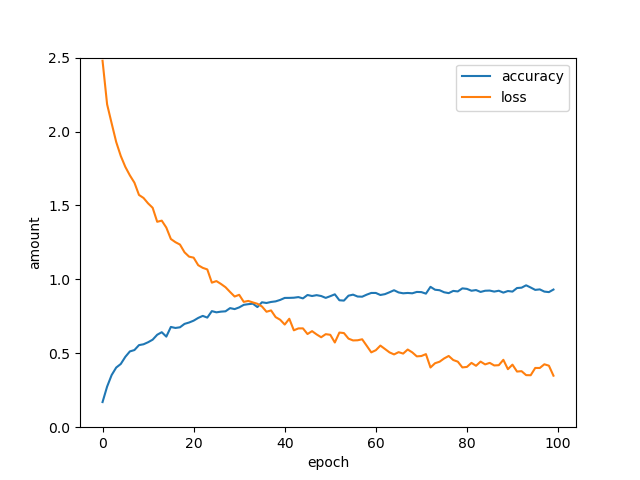
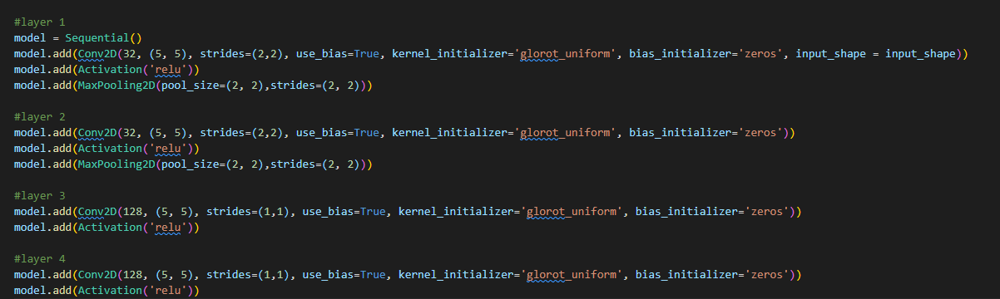
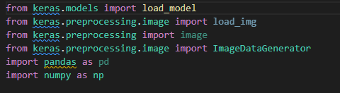
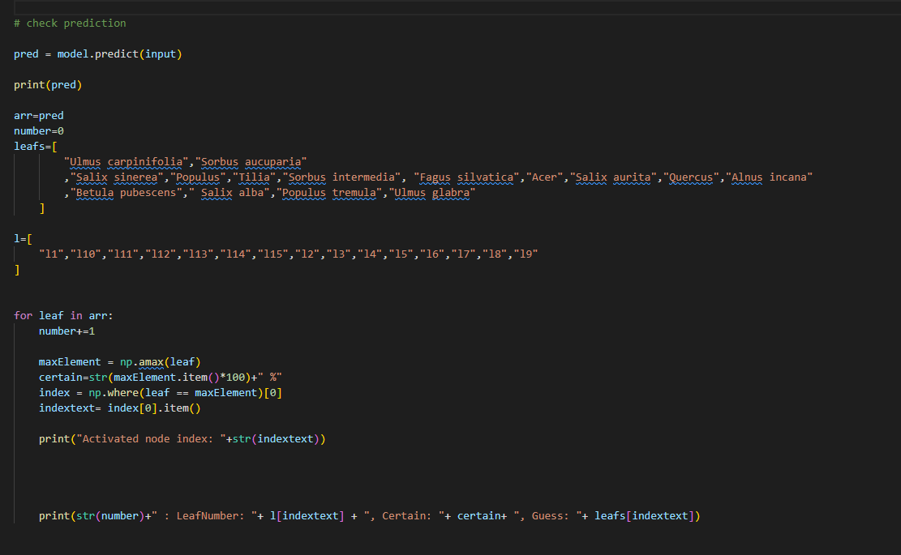
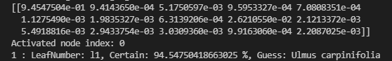

# Result

<!-- TODO: 

Beschrijf de uitwerking in minimum 500 woorden. Maak gebruik van figuren, schema's en diagrammas om je tekst te verduidelijken.
Maak eerst een overzicht van alle onderdelen en geef een algemene beschrijving. Duik daarna in alle onderdelen en werk ze stuk voor stuk uit. 

-->

## Image Processing with Matlab

 The dataset contains all the images but they all vary in resolution and for the training model we need them to be black and white, in order to make all the images uniform we created a [matlab program](https://github.com/ThomasLuca/leaf-dataset-preparation/blob/main/ImageManipulation.m) to do this.

 the first part of the program searches for the objects in the image

 
 
the second part of the code crops the image according to what the largest feature is from the previous code. this we then converted to grayscale and added white borders on the sides so the image would fit a resolution of 324 pixels by 324 pixels.
 before:

 

### before:

 

### after:

  

## Training model with Keras on python

### Set up

We would recommend [creating a new conda environment](https://docs.conda.io/projects/conda/en/latest/user-guide/tasks/manage-environments.html#creating-an-environment-with-commands) before installing these packages.

To install the packages needed for training and predictions, you can execute the following command:

```cmd
pip install -r ./requirements.txt
```

or you can look at the requirements.txt file and manually install them separately:

```cmd
pip install keras
pip install matplotlib
...
```

After processing the images in Matlab you should have a folder named "prepared", with all the processed images in them. Every image is named accordingly : "l5nr075", "l" stands for leaf, after that is the number of the species listed on the [Swedish tree website](https://www.cvl.isy.liu.se/en/research/datasets/swedish-leaf/), after that is its number, there are 75 images per species.

Now its time for some tedious copy paste work. We are going to put all the images in separate folders.
First we create a folder named "data", in that folder we create 2 more folders: a "train" folder and a "validation" folder.
In the "train" folder we are going to create a folder for every species, which is 15, we name them "l1", "l2",... .


In those folders we are going to put 60 of the 75 images from every species in their responding folders, so in folder l1 there should be l1nr001 to l1nr060.


In the validation we also make make folders l1 to l15, in those we put the remaining 15 images per species, so in l1 there should be l1nr061 to l1nr075.


Then make sure the images are correctly distributed in folders, there should  be a "train" and a "validation" folder, in those folders every species should be in a different folder.


Now that everything is ready to run, lets explain the code.

### Code

We didn't write the model ourselves, we used the project of the Github user [ralavo](https://github.com/ralavo/Leaf-Classification), his project had a great model but no datasets or predictions, so we build onto it and changed it for our purposes.

Let's get into the code.

First we see all the imports of the installed packages.


Under that we see the parameters ,the images are processed to 324x324 in Matlab, so we need to tell the model the inputted images will be that size, after that we tell the model where to find the training and validation images. The samples are how many images there are in each folder. In de training folder, there are 15 species and each species contains 60 images, so 15*60=900. And the same goes for the validation folder, but in that folder every species has 15 images, so 15*15=225. We found that 100 epochs is a good amount of training. The batch size should be dividable by 900, we found that a high batch size of 45 gave a better result.


Here are some of the tests we did on the batching.

First we tried a batch size of 10:


Then a batch size of 20:


We were satisfied with the batch size of 45:


We also did some tests with adding more nodes to the network, in layers 3,4,5 we added 128 nodes instead of 64 with this result:


Bumping it up to 256 nodes did not improve the accuracy further.



So lets go back to the code, underneath those parameters we see some code which defines how the input is shaped. It will have 3 channels: Red, Green and blue, which doesn't really matter since we greyscaled our images.


Then we see al the layers, the model uses 2DConvolution, batch Normalization as regularization method and relu as Activation function.
We won't explain every layer, but this image gives you the idea how the layers work.




Now that the layers are defined, we tell the model how to compile and how to process the images for input.

The train and validation generators take the images fom their folders and use the folder they come from as label, so all the images in folder "l1" will have the label "l1". We tell the model to classify by category (15 species)

Then we train the model.

The results like accuracy and loss are written in a csv file by the csv logger.


Then we save the trained model to use it in the predictions.


And in the end we plot the accuracy and loss of model during the training by reading out the csv file.


A plot will look like this:


## Prediction with trained Keras model on python

### Set up prediction

To set up the prediction we just have to make a folder in the project "img" in that folder we create a folder with name of choice, we chose "test", and in that "test" folder we can put the images we want predictions for, make sure those pictures have been processed by Matlab to have the right size and color.


At the top we see the imported packages.



Then we load in the trained model and define the size of the new input images. It will be 324x324, because it went through the Matlab image processing.


After that we put the images through the generator so the model will take them as input, the generator is the same as in the training code. The only difference is we set the class_mode to None, because the input doesn't need to be labeled.


Then we put the input images into the model and let the model predict.

The predictions the model returns is an array of 15 numbers between 0 and 1, that stands for the certainty of the which species it think it is. Then we look at which certainty is the highest and its responding species.



The output will look like this.


